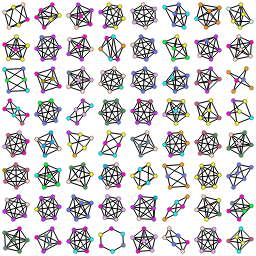

# Semi-Supervised Learning for Materials Informatics

Kat Nykiel, Purdue University!



----> [Presentation video](https://www.youtube.com/watch?v=SYkvCYVPT0k) <----

This is the README file for my ECE 570 Project. Here I follow the format established in the [project guidelines](https://www.davidinouye.com/course/ece57000-fall-2023/project/logistics-final-project.pdf.), with directions referenced in blockquotes.

> You should include a README and all necessary code to run your experiments but no dataset

## Running the Experiments

> Explain how to run the experiments

These experiments were run in Google Colab, using T4 GPUs purchased with Google Colab Pro. Instructions on the two experiments implemented in this paper are described below.

### Training FlexMatch and FixMatch on CIFAR-10

To re-run the experiment, run the following files.

- `copied/fixmatch_cifar.ipynb`
- `copied/flexmatch_cifar.ipynb`

### Training FlexMatch and FixMatch on MatProject Data

This experiment requires an API key from Materials Project to download the dataset, which can be obtained for free [here](https://next-gen.materialsproject.org/api#mp-api-info). This is saved in a file at path `~/.mpkey.txt` so API keys are not stored in the repository.

To re-run the experiment, run the following files, in order:

- `original/mp-query.py`
- `original/preprocessing.py`
- `modified/fixmatch_mp.ipynb`
- `modified/flexmatch_mp.ipynb`

## Code Description

The code has been divided up into three folders, to make my contributions clear.

### Copied

> Describe which code files have been copied from other repositories with references to these

Rerunning of FlexMatch and FixMatch on CIFAR-10 was done by copying the `Beginner_Example.ipynb` in the [semilearn repository](https://github.com/microsoft/Semi-supervised-learning) and modifying minimally to adjust the hyperparameters for training in a reasonable time. The [Beginner_Example.ipynb notebok](https://github.com/microsoft/Semi-supervised-learning/blob/main/notebooks/Beginner_Example.ipynb) is placed in the `copied` folder for reference, while the slightly modified FlexMatch and FixMatch notebooks are placed there as well. The number of training iterations is decreased from `5000` to `2000`.

### Modified

> Describe which code files have been modified and how they have been modified

Adapting the custom MatBench dataset to the semilearn repository was done by starting with the [Custom_Dataset.ipynb](https://github.com/microsoft/Semi-supervised-learning/blob/main/notebooks/Custom_Dataset.ipynb) notebook and modifying for the new dataset. The modifications are copied below.

```python
import json
import pandas as pd
from sklearn.model_selection import train_test_split

# Read the JSON file into a dictionary
with open("training_data.json", "r") as f:
    data = json.load(f)

# Convert this dictionary into a pandas DataFrame
df = pd.DataFrame(data)

# Convert list to np array of shape (10000, 32, 32, 3)
df["image"] = df["image"].apply(lambda x: np.array(x).reshape((-1, 32, 32, 3)))

# Get all of the values in the image column as a single np array of shape 10000,32,32,3
images_array = np.squeeze(np.stack(df["image"].values),axis=1)

# Set labels
target = df["stables"].values

# Split into training and eval sets
train_images, eval_images, train_labels, eval_labels = train_test_split(images_array, target, test_size=0.2, random_state=42)

# Add into a custom training dataset
lb_data, lb_target, ulb_data, ulb_target = split_ssl_data(config, np.uint8(train_images), train_labels, 2, config.num_labels, include_lb_to_ulb=config.include_lb_to_ulb)
```

In addition, the original repository used the labeled data for evaluation - not very helpful! This was modified.

```python
eval_dataset = BasicDataset(config.algorithm, np.uint8(eval_images), eval_labels, config.num_classes, eval_transform, is_ulb=False)
```

Finally, the hyperparameters were changed to allow for a reasonably trained model given the time constraints.

```python
config = {
    'algorithm': 'flexmatch',
    'net': 'vit_tiny_patch2_32',
    'use_pretrain': True,
    'pretrain_path': 'https://github.com/microsoft/Semi-supervised-learning/releases/download/v.0.0.0/vit_tiny_patch2_32_mlp_im_1k_32.pth',

    # optimization configs
    'epoch': 1,
    'num_train_iter': 5000,
    'num_eval_iter': 500,
    'num_log_iter': 50,
    'optim': 'AdamW',
    'lr': 5e-4,
    'layer_decay': 0.5,
    'batch_size': 16,
    'eval_batch_size': 16,
    ...
}
```

### Original

> Describe which code files are the student's original code.

`mp-query.py`: This file queries Materials Project for structures and their stability on the convex hull, then generates a JSON file of the results.

`crystal_embed.py`: This file defines a function called `visualize_structure` that takes a crystal structure as input and generates a graph representation of the structure using plotly and networkx libraries, and returns the RGB data of the generated image.

`preprocessing.py`: This file calls `visualize_structure` and returns the entire dataset of images and stability for training, in JSON format.

## Dataset Description

> Include a description of the datasets you used and where you obtained them.

The *CIFAR-10 dataset* used for evaluating base FlexMatch/FixMatch performance is a dataset of 60,000 color images, each 32x32 pixels, of 10 different classes. This dataset is publicly available and widely used in machine learning. In this implementation, it was loaded using the [semilearn repository](https://github.com/microsoft/Semi-supervised-learning).

The *Materials Project dataset* I used was a collection of crystal structures from Materials Project, an online repository of density-functional theory results. I used 10,000 structures with 6-12 atoms. It was obtained using the [Materials Project API](https://next-gen.materialsproject.org/api#mp-api-info).
